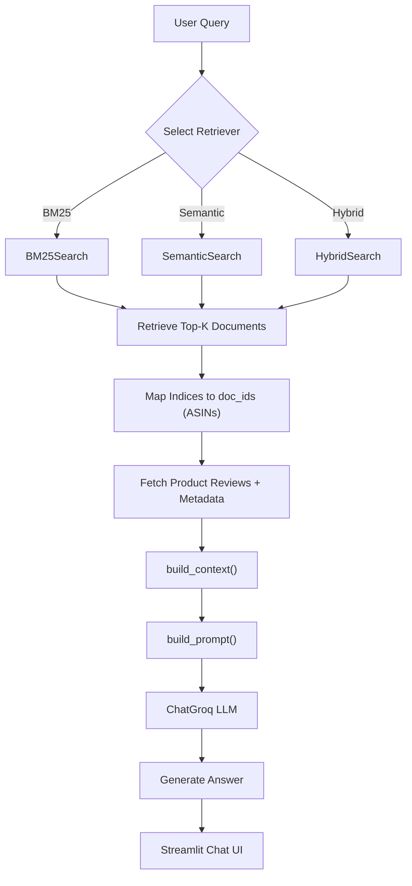

# Smart Amazon Product Query Assistant

## Motivation
We are creating a context-aware product search assistant that returns relevant Amazon products based on natural language queries. The assistant contains multiple systems and will be implemented in two Milestone stages:

#### Milestone 1:
- BM25
- Semantic Search
- Hybrid Search (Combination of BM25 and Semantic)

#### Milestone 2:
- LLM
- RAG Pipeline

#### Language Model Selection
The RAG workflows in this application utilize the **Llama-3.3-70b-versatile** model, accessed via the Groq API (`ChatGroq`). 
* **Why this model:** Llama 3.3 70B is a state-of-the-art open-weights model that excels at instruction following and summarization, making it ideal for synthesizing Amazon product reviews. 
* **Why Groq:** Groq's custom LPU (Language Processing Unit) hardware provides ultra-fast inference speeds. This is critical for RAG applications, as the system must process a large prompt containing multiple retrieved product documents and generate a response without introducing noticeable latency for the user.

#### Semantic RAG Workflow
The Semantic RAG pipeline retrieves documents based on contextual meaning rather than exact keyword matches. 
1. **Embedding:** The document corpus (product metadata and reviews) is embedded using the `all-MiniLM-L6-v2` model from `sentence-transformers`. This creates dense vector representations of the text.
2. **Indexing:** The embeddings are L2-normalized and stored in a **FAISS** index (`IndexFlatIP`) to allow for highly efficient Inner Product (cosine similarity) nearest-neighbor searches.
3. **Retrieval & Generation:** When a user asks a question, their query is converted into an embedding using the same MiniLM model. FAISS retrieves the top `k` most semantically similar product documents. These documents are dynamically formatted into a context string and passed alongside the user's query to the Llama 3 model to generate a natural language response.

#### Hybrid RAG Workflow
The Hybrid RAG pipeline merges the precision of exact keyword matching (BM25) with the contextual awareness of dense embeddings (Semantic/FAISS) to provide the most robust retrieval results.
1. **Candidate Generation:** For a given query, the system fetches a wide pool of candidates (e.g., `top_k + 100`) from *both* the BM25 and Semantic retrievers independently.
2. **Score Normalization:** Because BM25 scores are unbounded and FAISS cosine similarities fall roughly between [-1, 1], the scores are normalized to a standard `[0, 1]` scale:
   - *BM25:* Normalized using max-scaling (dividing all scores by the maximum score in the set).
   - *Semantic:* Shifted and clipped to fall strictly between 0 and 1.
3. **Weighted Combination:** The normalized scores for each document are combined using a weighted formula: `hybrid_score = (alpha * norm_sem) + ((1.0 - alpha) * norm_bm25)`. Currently, `alpha` is set to `0.5`, giving equal weight to both keyword and semantic matches.
4. **Generation:** The top `k` documents with the highest combined hybrid scores are injected into the context prompt and passed to the Llama 3 model for the final generated answer.

## Installation

### Clone the project and install the Python environment
```bash
# Clone the repository
git clone https://github.com/UBC-MDS/DSCI_575_project_hli76_wnsong.git
cd DSCI_575_project_hli76_wnsong

# Create and activate the conda environment
conda env create -f environment.yml
conda activate dsci575-project
```

### Download Data
Run the following command will download and generate the required files:
```bash
python src/download_data.py
```
- raw data for reviews and meta data as parquet file
    - `data/raw/Appliances_meta_raw.parquet`
    - `data/raw/Appliances_reviews_raw.parquet`
- merged data (reviews + meta data) where each review is a single row in a parquet file
    - `data/processed/Appliances_merged.parquet`
- document ids (`parent_asin`) in a pickle file
    - `data/processed/Appliances_doc_ids.pkl`
- product documents in a pickle file
    - `data/processed/Appliances_product_documents.pkl`
- merged product data where each product is a single row in a parquet file
    - `data/processed/Appliances_products.parquet`

### Other Saved Files
- `data/queries.csv`: 21 queries used for testing
- Files created by `src/bm25.py`:
    - `data/processed/bm25.pkl` 
    - `data/processed/tokenized_corpus.pkl` 
- Files created by `src/semantic.py`:
    - `data/processed/faiss.index`
- feedback from `app/app.py`
    - `data/processed/feedback.csv`

### Run Web Application Locally

Downnload and checkout the demo video here: [App Demo](app-demo.mp4)

Run the following command at the project root:
```bash
streamlit run app/app.py
```

Streamlit will display a local URL such as :
```bash
You can now view your Streamlit app in your browser.

  Local URL: http://localhost:[port]
  Network URL: http://[address]
  External URL: http://[address]
```
Please check your terminal for the correct address.

### 🤖 Enabling LLM & Web Search Features
To run the RAG assistant and live web search locally, you need to set up your own environment variables. 

1. Create a new file named `.env` in the root directory of the project.
2. Add your API keys to the file as shown below:

```env
# 1. Get your free key at: (https://console.groq.com/)
GROQ_API_KEY=gsk_your_groq_key_here

# 2. Get your free key at: (https://tavily.com/)
TAVILY_API_KEY=tvly_your_tavily_key_here
```

### Project Structure
```
│
├── app/
│   └── app.py                                 # Streamlit UI for querying BM25, Semantic, and Hybrid search
│
├── data/
│   ├── processed/                             # Preprocessed, indexed, and model-ready data
│   │   ├── Appliances_merged.parquet          # Product-level merged metadata + aggregated reviews
│   │   ├── Appliances_product_documents.pkl   # Text documents used for BM25 & Semantic search
│   │   ├── Appliances_doc_ids.pkl             # Mapping from document index → parent_asin
│   │   ├── Appliances_products.parquet        # Product-level structured data (title, price, features)
│   │   ├── bm25.pkl                           # Saved BM25 index
│   │   ├── tokenized_corpus.pkl               # Tokenized corpus used by BM25
│   │   └── faiss.index                        # FAISS vector index for Semantic search
│   │
│   ├── raw/
│   │   ├── Appliances_meta_raw.parquet        # Original metadata from Amazon Reviews 2023
│   │   └── Appliances_reviews_raw.parquet     # Original review data from Amazon Reviews 2023
│   │
│   └── queries.csv                            # Query set used for evaluation and testing
│
├── notebooks/
│   ├── milestone1_exploration.ipynb           # Exploration of BM25, Semantic, Hybrid methods
│   ├── milestone2_rag.ipynb                   # Add RAG pipeline
│   ├── demo.ipynb                             # Demonstration notebook for search pipeline
│   └── <OTHER NOTEBOOKS>                      # Additional analysis or experimentation
│
├── src/
│   ├── bm25.py                                # BM25 implementation + index building
│   ├── semantic.py                            # Semantic search using SentenceTransformer + FAISS
│   ├── hybrid.py                              # Hybrid implementation
│   ├── rag_pipelijne.py                       # RAG Pipeline implementation
│   ├── utils.py                               # Helper functions (loading data, preprocessing, etc.)
│   └── download_data.py                       # Script to download and preprocess Amazon data
│
├── results/
│   ├── milestone1_discussion.md               # Evaluation results and discussion for Milestone 1
│   └── milestone2_discussion.md               # Evaluation results and discussion for Milestone 2
│
├── README.md                                  # Description of the project
├── environment.yml                            # Required package environment
├── app-demo.mp4                               # Demo video
├── .env                                       # Optional: API keys for LLM-based querying (not in repo)
└── LICENSE
```

## RAG Pipeline Workflow Diagram


### Pipeline Model Choice & Rationale

**Chosen Model:** `llama-3.3-70b-versatile` (Served via the Groq API)

**Rationale Behind Model Family (Llama vs. Qwen / Phi):**
We selected the **Llama 3.3** architecture over alternatives like Qwen or Phi for this specific English-language RAG workflow. 
* While Microsoft's **Phi-4** and **Phi-4-reasoning** models are incredibly efficient Small Language Models (SLMs) that punch above their weight in logic puzzles, they lack the vast world knowledge and broad vocabulary necessary to seamlessly synthesize highly varied, subjective Amazon product reviews. 
* While **Qwen** models are exceptional for multilingual and heavy coding tasks, Llama remains the industry standard for general English NLP instruction-following. 
* Furthermore, Llama models feature first-class, highly optimized support on Groq's ecosystem, making integration flawless.

**Rationale Behind Model Size (70B vs. 0.5B / 3B / 8B):**
We opted for a massive **70-billion parameter** model rather than a smaller variant (like 3B, 8B, or 14B).
* **Context Synthesis:** In a RAG pipeline, the prompt is stuffed with multiple lengthy product reviews, creating a lot of "noise." Smaller models (like an 8B) frequently suffer from the "lost-in-the-middle" phenomenon or hallucinate details when overwhelmed by text. The 70B model possesses the deep reasoning capabilities required to accurately weigh sentiment, extract factual specifications, and ignore irrelevant review tangents.
* **Cost vs. Compute:** Typically, a 70B model is too slow and computationally expensive for a responsive chatbot. However, because we are offloading the inference to Groq's specialized LPU hardware, we can leverage the immense intelligence of a 70B model with the speed and latency typically associated with running a 3B model.


## Data Source

There are total 33 product categories in the Amazon Reviews 2023 dataset. Each category contains two files:
- Review file (`<Category>.jsonl.gz`): user-written reviews, ratings, timestamps, votes.
- Metadata file (`meta_<Category>.jsonl.gz`): product titles, descriptions, features, price, categories.

- For script-based download, please see Installation section above.

- For manual download and field descriptions: 
- Project website:[https://amazon-reviews-2023.github.io/](https://amazon-reviews-2023.github.io/)

- Hugging Face dataset: [https://huggingface.co/datasets/McAuley-Lab/Amazon-Reviews-2023](https://huggingface.co/datasets/McAuley-Lab/Amazon-Reviews-2023)

## License

See [LICENSE](LICENSE) for details.

## Team

See [team.txt](team.txt) for team member information.
